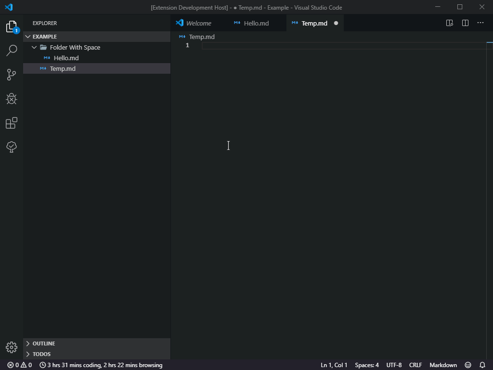
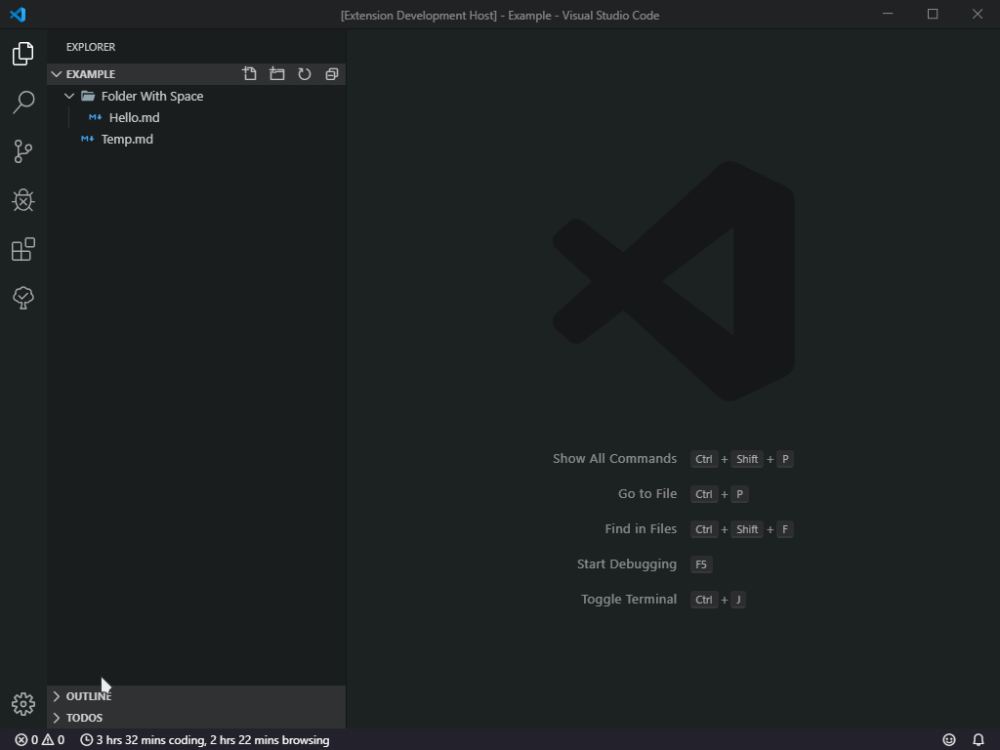

## 🔑 Encoded Relative Path

Encoded Relative path support for Visual Studio Code

> Orijinal one is [RelativePath](https://github.com/jakob101/RelativePath)

## 🗽 Instruction

- Just press <kbd>✲ Ctrl</kbd> <kbd>⇧ Shift</kbd> <kbd>H</kbd> (Mac: <kbd>✲ Cmd</kbd> <kbd>⇧ Shift</kbd> <kbd>H</kbd>) and select a file.
- If your workspace has more than 1000 files, you will be prompted to filter that list first.
- Alternatively, you can press open command palette `F1` or <kbd>✲ Ctrl</kbd> <kbd>⇧ Shift</kbd> <kbd>P</kbd> and search for `Encoded Relative Path`.

### Example Usage



### Example Shotcut Setting



## ❗ Important

### 📂 In Multi root workspaces:

Everytime you switch to a file from a different folder the files in that folder are indexed and
cached to improve search performance. If you have multiple large folders part of a workspace
frequent switches between folders might slow you down.

### 📁 In Single project workspace:

The caching of the filelist in the project happens only once. If your workspace contains a lot of files
please wait for the initial file list to be created.

## ⛏ Options

The following Visual Studio Code settings are available for the RelativePath extension. They can be set in user preferences (`ctrl+,` or `cmd+,`) or workspace settings (.vscode/settings.json).

```javascript

	// An array of glob keys to ignore when searching.
	"encodedRelativePath.ignore": [
		"**/node_modules/**",
		"**/*.dll",
		"**/obj/**",
		"**/objd/**"
	],

	// A glob by which to filter results
	"encodedRelativePath.include": "/**/*.*"

	// Excludes the extension from the relative path url (Useful for systemjs imports).
	"encodedRelativePath.removeExtension": false,

	// An array of extensions to exclude from the relative path url (Useful for used with Webpack or when importing files of mixed types)
	"encodedRelativePath.excludedExtensions": [
		".js"
	],

```

> For more options type `encodedRelativePath.` in `settings.json`.

## 💖 Support & Contact

​[​​](https://github.com/yedhrab) [​​](https://www.linkedin.com/in/yemreak/) [​​](https://yemreak.com/) [​​](mailto::yedhrab@gmail.com?subject=EncodedRelativePath%20%7C%20Github)​

​[​](https://www.patreon.com/yemreak/)

## 🔏 Lisans

**The** [**Apache 2.0 License**](https://choosealicense.com/licenses/apache-2.0/) **©️ Yunus Emre Ak**


